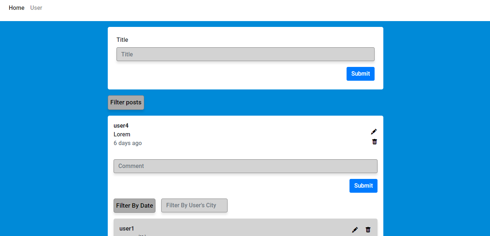

# Node project
This is the project I made for the start2impact node.js path.

## :clipboard: Table of Content
* Description
* Installation
* Built
* Packages
* Author
* License

## :memo: Description
Through this application you can write posts that you can later modify or delete. In addition, it will allow you to interact with other users by commenting on their posts they wrote one. To do this, you need to access the home by inserting your nickname, your age and the city where you live.


[click to watch](https://gv-information-app.onrender.com)

## :floppy_disk: Installation

* to clone the repository type the command:

```
git clone https://github.com/GiovanniValastro/node-project
  ```

* After then install the dependencies shown in the file [package.json](https://github.com/GiovanniValastro/node-project/blob/master/package.json) or [below](#dependencies) with npm:

```
npm i 
```

* finally create an .env file in which to insert the string to connect to your database on mongoDB Atlas and a variable called SECRET_SESSION to use the express-session package

```
MONGO_CONNECT = mongodb+srv://...
SECRET_SESSION = your session secret
```

## :hammer_and_wrench: Built
* Javascript
* Ejs
* Css

## :package: Packages

### Dependencies 

* [body-parser: 1.20.0](https://www.npmjs.com/package/body-parser)
* [cors: 2.8.5](https://www.npmjs.com/package/cors)
* [dotenv: 16.0.1](https://www.npmjs.com/package/doetenv)
* [ejs: 3.1.8](https://www.npmjs.com/package/ejs)
* [express: 4.18.1](https://www.npmjs.com/package/)
* [express-mongo-sanitize: 2.2.0](https://www.npmjs.com/package/)
* [express-session: 1.17.3](https://www.npmjs.com/package/)
* [helmet: 6.0.0](https://www.npmjs.com/package/helmet)
* [joi: 17.7.0](https://www.npmjs.com/package/joi)
* [moment: 2.29.4](https://www.npmjs.com/package/moment) 
* [mongoose: 6.5.2](https://www.npmjs.com/package/mongoose) 
* [morgan: 1.10.0](https://www.npmjs.com/package/morgan) 
* [serve-favicon: 2.5.0](https://www.npmjs.com/package/serve-favicon) 

### DevDependencies 

* [nodemon: 2.0.18](https://www.npmjs.com/package/nodemon)

## :frowning_man:	Author
For more information visit [my website](https://giovannivalastro.github.io/).

## :page_with_curl: License
Distributed under the MIT License. See [LICENSE.txt](https://github.com/GiovanniValastro/node-project/blob/master/LICENSE) for more information.
